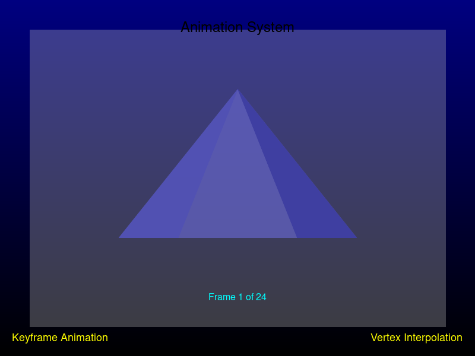
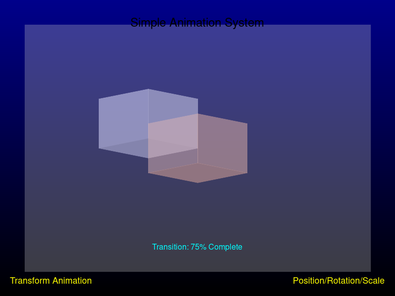
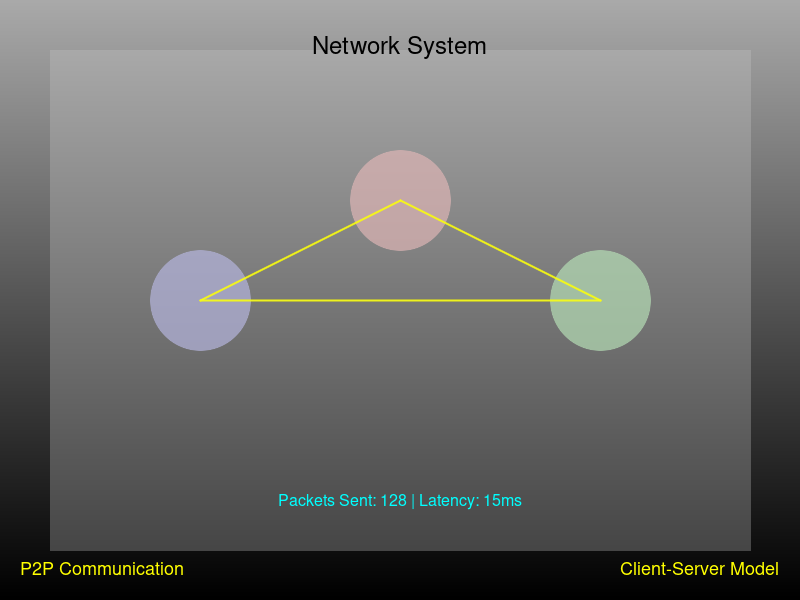

# GameEngineSavi

GameEngineSavi is a lightweight C++ game engine designed for creating 3D games with OpenGL. The engine provides a component-based architecture similar to popular game engines like Unity, making it intuitive for developers familiar with those frameworks.

## Features

- **Component-Based Architecture**: Utilize GameObject and MonoBehaviourLike components to create modular game logic
- **3D Rendering**: Built-in support for 3D models with OBJ file loading
- **Scene Management**: Create and manage game scenes with multiple objects
- **Lighting System**: Dynamic point light system with customizable properties
- **Camera System**: Flexible camera implementation for scene viewing
- **Time Management**: Precise time tracking for frame-rate independent gameplay
- **Math Utilities**: Vector3 and Matrix4x4 implementations for 3D mathematics
- **Prefab System**: Create reusable game object templates
- **Physics System**: Rigid body physics with collision detection and response
- **Texture System**: Support for texture mapping with tiling, opacity, and normal maps
- **Engine Condition System**: Different engine states for editing, playing, and compiling
- **Debugger System**: Comprehensive error handling for script errors

## Architecture

The engine is structured around these core components:

### Core Components

- **GameObject**: The fundamental entity in the engine that can contain components, meshes, and child objects
- **MonoBehaviourLike**: Base class for all behavior components with lifecycle methods (Awake, Start, Update, etc.)
- **Scene**: Manages game objects, cameras, and the game loop
- **TimeManager**: Handles time-related functionality for frame-rate independent gameplay

### Rendering System

- **Model**: Handles 3D model loading and rendering
- **Face/Triangle**: Basic geometric primitives
- **Pyramid**: Example of a built-in 3D shape
- **Camera**: Manages the view perspective
- **PointLight**: Implements dynamic lighting with attenuation

### Physics System

- **PhysicsSystem**: Manages physics simulation with fixed timestep
- **RigidBody**: Handles physical properties like mass, velocity, and forces
- **CollisionSystem**: Detects and resolves collisions between objects

### Math Utilities

- **Vector3**: 3D vector implementation with common operations
- **Matrix4x4**: Matrix operations for 3D transformations
- **Raycast**: Ray casting for collision detection

### Additional Features

- **Prefab**: Template system for creating reusable game objects
- **GUI**: User interface system for creating editor and game interfaces
- **ProjectSettings**: Project configuration management
- **Debugger**: Error handling and reporting system

## Installation

### Linux
1. Clone the repository:
   ```bash
   git clone https://github.com/ignaciosgithub/GameEngineSavi.git
   cd GameEngineSavi
   ```

2. Build the engine:
   ```bash
   make
   ```

### Windows
1. Clone the repository:
   ```batch
   git clone https://github.com/ignaciosgithub/GameEngineSavi.git
   cd GameEngineSavi
   ```

2. Using Visual Studio:
   - Open the solution file
   - Build using Visual Studio

3. Using MinGW:
   ```batch
   mingw32-make -f Makefile.mingw
   ```

## Visual Studio 2022 Setup

GameEngineSavi includes full support for Visual Studio 2022, making it easy to develop games on Windows.

### Quick Setup

1. **Prerequisites**:
   - Visual Studio 2022 (Community, Professional, or Enterprise)
   - Desktop development with C++ workload installed
   - Windows 10 or 11

2. **Open the Solution**:
   - Clone the repository
   - Open `GameEngineSavi.sln` in Visual Studio 2022

3. **Build and Run**:
   - Select your desired configuration (Debug/Release) and platform (x64/Win32)
   - Press F7 to build or F5 to build and run

### Detailed Documentation

For comprehensive Visual Studio 2022 setup instructions, debugging tips, performance optimization, and more, see our [detailed Visual Studio 2022 guide](VS2022_GUIDE.md).

This guide covers:
- Complete project setup
- Building configurations
- Debugging techniques
- Project structure
- Creating new games
- Using advanced features
- Troubleshooting common issues
- Performance optimization

## Creating a New Project

1. Create project structure:
   ```cpp
   #include "ProjectSettings/ProjectSettings.h"

   auto& settings = ProjectSettings::GetInstance();
   settings.CreateNewProject("MyGame", "path/to/project");
   ```

2. Project Structure:
   ```
   MyGame/
   ├── Assets/
   │   ├── Models/
   │   ├── Textures/
   │   ├── Sounds/
   │   └── Scripts/
   ├── Build/
   └── project.json
   ```

3. Configure project settings in project.json:
   ```json
   {
       "projectName": "MyGame",
       "engineVersion": "1.0.0",
       "buildSettings": {
           "debugSymbols": true,
           "optimization": false,
           "targetPlatforms": ["Windows", "Linux"]
       },
       "engineSettings": {
           "physics": {
               "fixedTimeStep": 0.01666667,
               "gravity": 9.81,
               "enableCollisions": true
           },
           "rendering": {
               "targetFPS": 60,
               "vsync": true
           }
       }
   }
   ```

## Time Management

The engine uses a high-resolution clock for precise timing:

```cpp
// Get delta time between frames
float dt = TimeManager::GetInstance().DeltaTime();

// Physics uses fixed timestep
float fixedDt = ProjectSettings::GetInstance().GetFixedTimeStep();
```

Time is managed through two systems:
1. EngineTime: Frame-based timing for rendering
2. Fixed timestep: Physics simulation at 60Hz

## Engine States

The engine operates in different states:
1. IN_EDITOR_PLAYING: Game running in editor window
2. DEBUG_BUILD: Debug build with detailed error reporting
3. IN_EDITOR_EDITING: Editor mode state
4. RELEASE: Release build state
5. IN_EDITOR_COMPILING: Game compilation state

Switch states using:
```cpp
EngineCondition::SetState(EngineCondition::State::DEBUG_BUILD_STATE);
```

## Default Scene Configuration

New scenes include:
1. One point light at position (0, 5, 0)
2. Default cube object at position (0, 0, 0)
3. Free camera system at position (0, 2, 5) looking at the origin

Example scene setup:
```cpp
auto scene = std::make_unique<Scene>();
scene->Load();

// Default point light
auto light = std::make_unique<PointLight>();
light->position = Vector3(0, 5, 0);
scene->AddLight(std::move(light));

// Default cube
auto cube = std::make_unique<GameObject>("Default Cube");
cube->SetPosition(Vector3(0, 0, 0));
scene->AddGameObject(std::move(cube));

// Free camera
auto camera = std::make_unique<Camera>();
camera->SetPosition(Vector3(0, 2, 5));
camera->LookAt(Vector3(0, 0, 0));
scene->AddCamera(std::move(camera));
```

## Editor Interface

The GameEngineSavi editor provides a visual interface for creating and editing game scenes. The editor is designed to be intuitive and easy to use, with a layout similar to popular game engines.

```
+----------------------------------------------------------------------------------------------------------+
|                                       GameEngineSavi Editor                                              |
+------------------+-----------------------------------------------+-----------------------------------+
|  Hierarchy       |                                               |  Inspector                        |
|                  |                                               |                                   |
|  > Default Light |                  Scene View                   |  Transform                        |
|  > Default Cube  |                                               |  Position: X: 0  Y: 0  Z: 0       |
|                  |                                               |  Rotation: X: 0  Y: 0  Z: 0       |
|                  |                                               |  Scale:    X: 1  Y: 1  Z: 1       |
|                  |                                               |                                   |
|                  |                                               |  Material                         |
|                  |                                               |  Albedo: [Default]                |
|                  |                                               |  Normal Map: [None]               |
|                  |                                               |  Opacity: 1.0                     |
|                  |                                               |                                   |
|                  |                                               |  Physics                          |
|                  |                                               |  [x] Use Gravity                  |
|                  |                                               |  [ ] Is Kinematic                 |
|                  |                                               |  Friction: 0.5                    |
+------------------+-----------------------------------------------+-----------------------------------+
|                                                                                                      |
|  Project                                                                                             |
|  [Models] [Textures] [Scenes] [Scripts] [Prefabs] [Audio]                                            |
|                                                                                                      |
+----------------------------------------------------------------------------------------------------------+
```

### Editor Panels

#### Hierarchy Panel
The Hierarchy Panel lists all objects in the current scene. By default, a new scene includes:
- Default Light: A point light positioned at (0, 5, 0)
- Default Cube: A cube positioned at (0, 0, 0)

You can:
- Click on an object to select it
- Right-click to create new objects
- Drag objects to reorder them
- Use the context menu to duplicate, delete, or rename objects

#### Scene View
The Scene View displays the 3D scene with the default cube and lighting. This is where you can:
- View and manipulate objects in 3D space
- Use the gizmos to move, rotate, and scale objects
- Navigate the scene using camera controls

#### Inspector Panel
The Inspector Panel shows properties of the selected object, including:
- Transform: Position, rotation, and scale
- Material: Albedo texture, normal map, opacity
- Physics: Gravity, kinematic state, friction
- Components: Any attached components and their properties

#### Project Panel
The Project Panel displays project assets organized by type:
- Models: 3D models (.obj files)
- Textures: Image files for materials
- Scenes: Saved scene files
- Scripts: C++ script files
- Prefabs: Reusable object templates
- Audio: Sound files

### Camera Controls

The editor camera is positioned at (0, 2, 5) by default, looking at the origin (0, 0, 0) where the default cube is placed.

- **WASD**: Move the camera
  - W: Move forward
  - A: Move left
  - S: Move backward
  - D: Move right
- **Mouse**: Look around by clicking and dragging in the Scene View
- **Shift**: Hold to move the camera faster
- **Space**: Play/Pause the scene to test game logic

### Editor Shortcuts

| Shortcut | Action |
|----------|--------|
| Ctrl+N | New Scene |
| Ctrl+O | Open Scene |
| Ctrl+S | Save Scene |
| Ctrl+Shift+S | Save Scene As |
| F | Focus Selected |
| W | Move Tool |
| E | Rotate Tool |
| R | Scale Tool |
| Q | No Tool (Selection Only) |
| Delete | Delete Selected |
| Ctrl+D | Duplicate Selected |
| Ctrl+Z | Undo |
| Ctrl+Y | Redo |
| Space | Play/Stop |
| F12 | Capture Screenshot |
| Ctrl+1 | Hierarchy Panel Focus |
| Ctrl+2 | Scene View Focus |
| Ctrl+3 | Inspector Panel Focus |
| Ctrl+4 | Project Panel Focus |

### Running the Editor

#### Linux
```bash
# Build the editor
./build_editor.sh

# Run the editor
./run_editor.sh
```

#### Windows
```batch
# Using Visual Studio
# Open GameEngineSavi.sln and build the solution

# Using MinGW
mingw32-make -f Makefile.mingw editor

# Run the editor
run_editor.bat
```

### Screenshot Functionality

The editor includes built-in screenshot functionality that allows you to capture the current view of the editor or game scene. This is useful for:

- Documenting your game development progress
- Creating promotional materials
- Reporting bugs or issues
- Sharing your work with others

To capture a screenshot:

1. Press the **F12** key while the editor is running
2. The screenshot will be saved to the `screenshots/editor/` directory
3. The filename will be `editor_interface.png` by default

You can also programmatically capture screenshots using the `Editor::CaptureScreenshot()` method:

```cpp
// Capture a screenshot with a custom filename
editor->CaptureScreenshot("my_custom_screenshot.png");
```

The screenshot functionality uses the `FrameCapture` class which reads the OpenGL frame buffer and saves it as a PNG file. This class can be used in your own games to implement screenshot functionality.

#### Editor Interface


#### Scene View
The scene view shows the 3D objects with proper lighting and perspective:


The editor interface includes:
- Hierarchy panel showing scene objects
- Inspector panel with object properties
- Scene view with 3D rendering
- Project panel for asset management


## Error Handling

The engine uses a robust error handling system:
1. Script errors are caught and reported
2. Warning messages instead of crashes
3. Debugger class for error management

Example error handling:
```cpp
try {
    // Your game code
} catch (const std::exception& e) {
    Debugger::LogError(e.what());
    // Engine continues running
}
```

## Getting Started

To use GameEngineSavi in your project:

1. Include the necessary header files in your project
2. Create a Scene to manage your game
3. Add GameObjects to your scene
4. Attach MonoBehaviourLike components to implement game logic
5. Call the Scene's Run method to start the game loop

## Example Usage

```cpp
// Create a new scene
std::unique_ptr<Scene> scene = std::make_unique<Scene>();

// Load the scene (initializes TimeManager)
scene->Load();

// Create a game object
std::unique_ptr<GameObject> player = std::make_unique<GameObject>(
    "Player",                  // Name
    Vector3(0, 0, 0),          // Position
    Vector3(0, 0, 0),          // Rotation
    Vector3(1, 1, 1),          // Size
    std::vector<PointLight>()  // Lights
);

// Add a model to the game object
Model* playerModel = new Model("player.obj", Vector3(0, 0, 0), Vector3(0, 0, 0));
player->AddMesh(playerModel);

// Add the game object to the scene
scene->AddGameObject(std::move(player));

// Create and add a camera
std::unique_ptr<Camera> mainCamera = std::make_unique<Camera>();
scene->AddCamera(std::move(mainCamera));

// Run the game
scene->Run();
```

## Test Suite

The engine includes a comprehensive test suite that verifies each component through console output. To run the tests:

### Linux
```bash
cd TestSuite
make
./run_tests
```

### Windows
```batch
cd TestSuite
run_tests.bat
```

The test suite verifies:
- Vector3 operations (addition, subtraction, multiplication, normalization, etc.)
- Physics simulation (gravity, velocity integration, collision detection)
- GameObject component management
- Scene management
- Engine condition state transitions
- Debugger error handling

Each test outputs detailed information to the console, allowing verification of component functionality without requiring visual inspection.

## Requirements

### Build Requirements
- C++ compiler with C++14 support
- OpenGL development libraries
  - Linux: `sudo apt-get install libgl1-mesa-dev libglu1-mesa-dev`
  - Windows: Included with Visual Studio or MinGW
- X11 development libraries (Linux only)
  - `sudo apt-get install libx11-dev`

### Build Tools
- Linux: GCC/G++ and Make
- Windows: Visual Studio or MinGW-w64 with GCC

### IDE Support
- Visual Studio Code (recommended)
- Visual Studio
- Any C++ IDE with CMake support

## License

This project is available for use under open-source terms.

## Animation System

GameEngineSavi includes a powerful animation system that allows you to create and play animations for your game objects. The animation system is based on keyframes using separate OBJ files of the same object in different poses, with linear interpolation between keyframes.

### Features

- **Keyframe-Based Animation**: Create animations using separate OBJ files for each keyframe
- **Linear Interpolation**: Smooth transitions between keyframes
- **Animation Components**: Attach animations to game objects
- **Animation Playback Control**: Play, pause, stop, and loop animations
- **Animation Events**: Trigger events at specific points in animations
- **Animation Blending**: Blend between multiple animations
- **Animation Speed Control**: Adjust animation playback speed

### Creating Animations

To create an animation, you need to:

1. Create OBJ files for each keyframe of your animation
2. Define an animation file (.savanim) that references these keyframes
3. Load the animation in your game

#### Animation File Format

Animation files use a simple JSON format:

```json
{
  "name": "walk",
  "keyframes": [
    {
      "time": 0.0,
      "mesh": "walk/cube_pose1.obj"
    },
    {
      "time": 0.33,
      "mesh": "walk/cube_pose2.obj"
    },
    {
      "time": 0.66,
      "mesh": "walk/cube_pose3.obj"
    },
    {
      "time": 1.0,
      "mesh": "walk/cube_pose4.obj"
    }
  ],
  "loop": true,
  "duration": 1.0
}
```

### Using Animations

Here's how to load and play an animation:

```cpp
#include "Animation/Animation.h"
#include "Animation/AnimationComponent.h"
#include "Animation/AnimationLoader.h"

// Load animation from file
Animation* walkAnimation = AnimationLoader::LoadAnimation("test_animations/walk/cube_walk.savanim");

// Create a game object
auto character = std::make_unique<GameObject>("Character");

// Add animation component
auto animComponent = character->AddComponent(new AnimationComponent());

// Add animation to component
animComponent->AddAnimation("walk", walkAnimation);

// Play animation
animComponent->PlayAnimation("walk");

// Add to scene
scene->AddGameObject(std::move(character));
```

### Animation Playback Control

You can control animation playback with these methods:

```cpp
// Get animation component
auto animComponent = gameObject->GetComponents<AnimationComponent>()[0];

// Play animation
animComponent->PlayAnimation("walk");

// Pause animation
animComponent->PauseAnimation();

// Resume animation
animComponent->ResumeAnimation();

// Stop animation
animComponent->StopAnimation();

// Set animation speed
animComponent->SetSpeed(2.0f); // Play at 2x speed

// Set looping
animComponent->SetLooping(true);

// Check if animation is playing
bool isPlaying = animComponent->IsPlaying();
```

### Animation Events

You can register callbacks to be triggered at specific points in an animation:

```cpp
// Register animation event
animComponent->RegisterEvent("walk", 0.5f, []() {
    // This will be called halfway through the walk animation
    std::cout << "Footstep sound!" << std::endl;
});
```

### Animation Blending

You can blend between multiple animations for smooth transitions:

```cpp
// Blend from walk to run over 0.5 seconds
animComponent->BlendTo("run", 0.5f);
```

### Animation with Physics

The animation system integrates with the physics system, allowing animated objects to interact with the physics world:

```cpp
// Create a game object with physics and animation
auto character = std::make_unique<GameObject>("Character");

// Add rigid body component
auto rigidBody = character->AddComponent(new RigidBody());
rigidBody->SetMass(10.0f);

// Add animation component
auto animComponent = character->AddComponent(new AnimationComponent());
animComponent->AddAnimation("walk", walkAnimation);
animComponent->PlayAnimation("walk");

// Animation will update the mesh, and physics will respond to the new shape
```

## Networking System

GameEngineSavi includes a comprehensive networking system that supports both peer-to-peer and client-server architectures. The networking system is designed to be flexible and easy to use, allowing developers to create multiplayer games with minimal effort.

### Features

- **Multiple Network Architectures**: Support for both peer-to-peer and client-server networking models
- **Cross-Platform Socket Handling**: Works on both Windows and Linux
- **Network Components**: Attach network behavior to game objects
- **Packet System**: Reliable and unreliable data transmission
- **Network Identity**: Unique identification for networked objects
- **Network Debugging**: Comprehensive logging and debugging tools
- **Connection Management**: Handle connections, disconnections, and timeouts

### Network Architecture

The networking system supports two main architectures:

1. **Client-Server**: Traditional architecture where a server hosts the game and clients connect to it
2. **Peer-to-Peer**: Direct connections between players without a central server

### Basic Setup

#### Server Setup

```cpp
#include "Network/NetworkSystem.h"

// Initialize network system as server
Network::NetworkSystem netSystem;
netSystem.Initialize(true, false);  // true = server, false = not peer-to-peer

// Start server on port 7777
netSystem.StartServer(7777);

// Enable debugging (optional)
netSystem.SetDebugLogging(true);

// Main loop
while (running) {
    // Update network system
    netSystem.Update();
    
    // Process incoming messages
    Network::Packet packet;
    while (netSystem.ReceivePacket(packet)) {
        // Handle packet based on type
        switch (packet.GetType()) {
            case Network::PacketType::CONNECT:
                std::cout << "Client connected: " << packet.GetSenderID() << std::endl;
                break;
            case Network::PacketType::DISCONNECT:
                std::cout << "Client disconnected: " << packet.GetSenderID() << std::endl;
                break;
            case Network::PacketType::DATA:
                std::cout << "Received data from client: " << packet.GetSenderID() << std::endl;
                // Process data
                break;
        }
    }
}

// Cleanup
netSystem.Cleanup();
```

#### Client Setup

```cpp
#include "Network/NetworkSystem.h"

// Initialize network system as client
Network::NetworkSystem netSystem;
netSystem.Initialize(false, false);  // false = client, false = not peer-to-peer

// Connect to server
netSystem.Connect("127.0.0.1", 7777);

// Enable debugging (optional)
netSystem.SetDebugLogging(true);

// Main loop
while (running) {
    // Update network system
    netSystem.Update();
    
    // Process incoming messages
    Network::Packet packet;
    while (netSystem.ReceivePacket(packet)) {
        // Handle packet based on type
        switch (packet.GetType()) {
            case Network::PacketType::CONNECT:
                std::cout << "Connected to server!" << std::endl;
                break;
            case Network::PacketType::DISCONNECT:
                std::cout << "Disconnected from server!" << std::endl;
                break;
            case Network::PacketType::DATA:
                std::cout << "Received data from server" << std::endl;
                // Process data
                break;
        }
    }
    
    // Send data to server
    if (shouldSendData) {
        Network::Packet dataPacket(Network::PacketType::DATA);
        dataPacket.Write("Hello Server!");
        netSystem.SendPacket(dataPacket);
    }
}

// Cleanup
netSystem.Cleanup();
```

#### Peer-to-Peer Setup

```cpp
#include "Network/NetworkSystem.h"

// Initialize network system in peer-to-peer mode
Network::NetworkSystem netSystem;
netSystem.Initialize(false, true);  // false = not server, true = peer-to-peer

// Start peer on port 7777
netSystem.StartPeer(7777);

// Connect to another peer
netSystem.ConnectToPeer("192.168.1.100", 7777);

// Main loop
while (running) {
    // Update network system
    netSystem.Update();
    
    // Process incoming messages
    Network::Packet packet;
    while (netSystem.ReceivePacket(packet)) {
        // Handle packet
    }
}

// Cleanup
netSystem.Cleanup();
```

### Network Components

You can attach network components to game objects to synchronize them across the network:

```cpp
#include "Network/NetworkComponent.h"
#include "Network/NetworkIdentity.h"

// Create a game object
auto player = std::make_unique<GameObject>("Player");

// Add network identity component
auto netIdentity = player->AddComponent(new Network::NetworkIdentity());
netIdentity->SetNetworkID(1);  // Set unique network ID

// Add network component
auto netComponent = player->AddComponent(new Network::NetworkComponent());

// Register properties to synchronize
netComponent->RegisterProperty("position", &player->position);
netComponent->RegisterProperty("rotation", &player->rotation);

// Add to scene
scene->AddGameObject(std::move(player));
```

### Network Debugging

The networking system includes comprehensive debugging tools:

```cpp
// Enable network debugging
netSystem.SetDebugLogging(true);

// Log all packets
netSystem.SetPacketLogging(true);

// Get connection statistics
Network::ConnectionStats stats = netSystem.GetConnectionStats();
std::cout << "Ping: " << stats.ping << "ms" << std::endl;
std::cout << "Packets sent: " << stats.packetsSent << std::endl;
std::cout << "Packets received: " << stats.packetsReceived << std::endl;
std::cout << "Bytes sent: " << stats.bytesSent << std::endl;
std::cout << "Bytes received: " << stats.bytesReceived << std::endl;
```

### Network Demo

The engine includes a network demo application that demonstrates the networking system in action. You can build and run the demo using the provided build scripts:

#### Linux
```bash
cd test_network
./build_network_demo.sh
../bin/linux/NetworkDemo --server     # Run in server mode
../bin/linux/NetworkDemo --client     # Run in client mode
../bin/linux/NetworkDemo --p2p        # Run in peer-to-peer mode
../bin/linux/NetworkDemo --debug      # Enable debugging
```

#### Windows
```batch
cd test_network
build_network_demo.bat
..\bin\windows\NetworkDemo.exe --server     # Run in server mode
..\bin\windows\NetworkDemo.exe --client     # Run in client mode
..\bin\windows\NetworkDemo.exe --p2p        # Run in peer-to-peer mode
..\bin\windows\NetworkDemo.exe --debug      # Enable debugging
```

## Shader System

GameEngineSavi includes a powerful shader system that allows you to create and use custom shaders for your game objects. The shader system supports vertex, fragment, and geometry shaders, and integrates seamlessly with the existing rendering pipeline.

### Features

- **Custom Shader Support**: Create and use your own shaders
- **Multiple Shader Types**: Support for vertex, fragment, and geometry shaders
- **Shader Asset Management**: Load and manage shader programs
- **Uniform Management**: Set shader uniforms easily
- **Cross-Platform Compatibility**: Works on both Windows and Linux
- **Error Handling**: Comprehensive error reporting for shader compilation and linking
- **Default Shaders**: Built-in shaders for common rendering tasks

### Shader Types

The shader system supports three types of shaders:

1. **Vertex Shaders**: Process vertices and transform them into clip space
2. **Fragment Shaders**: Calculate the color of each pixel
3. **Geometry Shaders**: Generate or modify geometry between vertex and fragment shaders

### Creating Shaders

Shaders are written in GLSL (OpenGL Shading Language). Here's an example of a simple vertex shader:

```glsl
// standard.vert
#version 330 core

layout(location = 0) in vec3 aPosition;
layout(location = 1) in vec2 aTexCoord;
layout(location = 2) in vec3 aNormal;

uniform mat4 model;
uniform mat4 view;
uniform mat4 projection;

out vec2 TexCoord;
out vec3 Normal;
out vec3 FragPos;

void main() {
    gl_Position = projection * view * model * vec4(aPosition, 1.0);
    TexCoord = aTexCoord;
    Normal = mat3(transpose(inverse(model))) * aNormal;
    FragPos = vec3(model * vec4(aPosition, 1.0));
}
```

And a corresponding fragment shader:

```glsl
// standard.frag
#version 330 core

in vec2 TexCoord;
in vec3 Normal;
in vec3 FragPos;

uniform sampler2D albedoTexture;
uniform bool hasAlbedoTexture;
uniform sampler2D normalTexture;
uniform bool hasNormalTexture;
uniform sampler2D opacityTexture;
uniform bool hasOpacityTexture;

uniform vec3 lightPos;
uniform vec3 lightColor;
uniform vec3 viewPos;

out vec4 FragColor;

void main() {
    // Base color
    vec4 color = hasAlbedoTexture ? texture(albedoTexture, TexCoord) : vec4(1.0, 1.0, 1.0, 1.0);
    
    // Normal mapping
    vec3 normal = normalize(Normal);
    if (hasNormalTexture) {
        vec3 normalMap = texture(normalTexture, TexCoord).rgb * 2.0 - 1.0;
        normal = normalize(normal + normalMap);
    }
    
    // Lighting calculation
    vec3 lightDir = normalize(lightPos - FragPos);
    float diff = max(dot(normal, lightDir), 0.0);
    vec3 diffuse = diff * lightColor;
    
    // Ambient light
    vec3 ambient = 0.1 * lightColor;
    
    // Specular light
    vec3 viewDir = normalize(viewPos - FragPos);
    vec3 reflectDir = reflect(-lightDir, normal);
    float spec = pow(max(dot(viewDir, reflectDir), 0.0), 32);
    vec3 specular = 0.5 * spec * lightColor;
    
    // Final color
    vec3 result = (ambient + diffuse + specular) * color.rgb;
    
    // Opacity
    float alpha = color.a;
    if (hasOpacityTexture) {
        alpha *= texture(opacityTexture, TexCoord).r;
    }
    
    FragColor = vec4(result, alpha);
}
```

### Loading and Using Shaders

To load and use shaders in your game:

```cpp
#include "Shaders/Assets/ShaderAsset.h"
#include "Shaders/Core/ShaderProgram.h"

// Load shader program
Shaders::ShaderProgram* standardShader = Shaders::ShaderAsset::LoadProgram(
    "Shaders/Defaults/standard.vert",
    "Shaders/Defaults/standard.frag"
);

// Create a game object with a model
auto cube = std::make_unique<GameObject>("Cube");
Model* cubeModel = new Model("cube.obj");

// Set shader program for the model
cubeModel->SetShaderProgram(standardShader);

// Add model to game object
cube->AddMesh(cubeModel);

// Add to scene
scene->AddGameObject(std::move(cube));
```

### Setting Shader Uniforms

You can set shader uniforms to control the appearance of your objects:

```cpp
// Get shader program
Shaders::ShaderProgram* shader = model->GetShaderProgram();

// Set uniforms
shader->SetUniform("lightPos", Vector3(0.0f, 10.0f, 0.0f));
shader->SetUniform("lightColor", Vector3(1.0f, 1.0f, 1.0f));
shader->SetUniform("viewPos", camera->GetPosition());

// Set texture uniforms
shader->SetUniform("albedoTexture", 0, albedoTexture->GetTextureID());
shader->SetUniform("hasAlbedoTexture", true);
```

### Default Shaders

The engine includes several default shaders:

1. **Standard Shader**: PBR (Physically Based Rendering) shader with lighting
2. **Unlit Shader**: Simple shader without lighting calculations
3. **Skybox Shader**: Shader for rendering skyboxes
4. **Post-Processing Shader**: Shader for post-processing effects

### Creating Custom Shaders

You can create your own custom shaders by:

1. Creating GLSL shader files
2. Loading them with ShaderAsset::LoadProgram
3. Assigning them to models

```cpp
// Load custom shader
Shaders::ShaderProgram* customShader = Shaders::ShaderAsset::LoadProgram(
    "MyShaders/custom.vert",
    "MyShaders/custom.frag",
    "MyShaders/custom.geom"  // Optional geometry shader
);

// Check for errors
if (!customShader) {
    std::cerr << "Failed to load custom shader!" << std::endl;
    return;
}

// Set shader for model
model->SetShaderProgram(customShader);
```

### Shader Error Handling

The shader system includes comprehensive error handling:

```cpp
// Load shader with error handling
Shaders::ShaderProgram* shader = Shaders::ShaderAsset::LoadProgram(
    "Shaders/custom.vert",
    "Shaders/custom.frag"
);

if (!shader) {
    // Get last error
    std::string error = Shaders::ShaderError::GetLastError();
    std::cerr << "Shader error: " << error << std::endl;
}
```

### Shader Preview in Editor

The engine's editor includes a shader preview feature that allows you to see your shaders in action before using them in your game. You can:

1. Load and compile shaders in the editor
2. Preview them on different models
3. Adjust shader parameters in real-time
4. See compilation errors and warnings

### Shader Demo

The engine includes a shader demo application that demonstrates the shader system in action. You can build and run the demo using the provided build scripts:

#### Linux
```bash
cd test_shaders
./build_shader_test.sh
../bin/linux/ShaderTest
```

#### Windows
```batch
cd test_shaders
build_shader_test.bat
..\bin\windows\ShaderTest.exe
```

## Visual Examples

Here are some visual examples of GameEngineSavi's capabilities:

### Editor Interface

*GameEngineSavi Editor with Default Cube and Scene View*


*Editor Scene View with Coordinate Axes and Default Cube Highlighted*

### Animation System

*Keyframe Animation with Vertex Interpolation*


*Object Animation with Transforms*

### Texture System

*Albedo, Normal Maps, and Opacity*

### Physics System

*Collision Detection and Rigid Body Physics*


*Gravity and Friction Simulation*

### Audio System


### Audio System Limitations
- The engine uses SDL_mixer for audio playback
- SDL_mixer does not support spatial audio features like Doppler effect
- Position and velocity of audio sources/listeners are tracked but do not affect audio playback
*MP3 Playback with Spatial Audio*

### Networking System

*P2P and Client-Server Communication*

### Camera System

*Main View with Minimap*

### Shader System

*Vertex, Fragment, and Geometry Shaders*

## Contributing

Contributions to GameEngineSavi are welcome! Feel free to submit pull requests or open issues to improve the engine.

## Networking System

The GameEngineSavi engine includes a comprehensive networking system that supports both peer-to-peer and client-server architectures. The networking system is designed to be flexible and easy to use, allowing developers to create multiplayer games with minimal effort.

### Features

- Support for both peer-to-peer and client-server networking models
- Cross-platform socket handling for Windows and Linux
- Network component that can be attached to game objects
- Packet system for reliable and unreliable data transmission
- Network debugging tools with packet logging and connection quality metrics

### Usage

To use the networking system, you need to include the appropriate headers:

```cpp
#include "Network/NetworkSystem.h"
#include "Network/NetworkComponent.h"
#include "Network/Packet.h"
```

#### Server Example

```cpp
// Initialize the network system as a server
Network::NetworkSystem netSystem;
netSystem.Initialize(true, false);  // true = server, false = not peer-to-peer
netSystem.StartServer(7777);        // Start server on port 7777

// Main loop
while (running) {
    netSystem.Update();
    // Handle network events
}

// Cleanup
netSystem.Cleanup();
```

#### Client Example

```cpp
// Initialize the network system as a client
Network::NetworkSystem netSystem;
netSystem.Initialize(false, false);  // false = client, false = not peer-to-peer
netSystem.Connect("127.0.0.1", 7777); // Connect to server at 127.0.0.1:7777

// Main loop
while (running) {
    netSystem.Update();
    // Handle network events
}

// Cleanup
netSystem.Cleanup();
```

#### Peer-to-Peer Example

```cpp
// Initialize the network system in peer-to-peer mode
Network::NetworkSystem netSystem;
netSystem.Initialize(false, true);  // false = not server, true = peer-to-peer
netSystem.StartPeer();

// Main loop
while (running) {
    netSystem.Update();
    // Handle network events
}

// Cleanup
netSystem.Cleanup();
```

### Network Demo

The engine includes a network demo application that demonstrates the networking system in action. You can build and run the demo using the provided build scripts:

#### Linux
```bash
cd test_network
./build_network_demo.sh
../bin/linux/NetworkDemo --server     # Run in server mode
../bin/linux/NetworkDemo --client     # Run in client mode
../bin/linux/NetworkDemo --p2p        # Run in peer-to-peer mode
../bin/linux/NetworkDemo --debug      # Enable debugging
```

#### Windows
```batch
cd test_network
build_network_demo.bat
..\bin\windows\NetworkDemo.exe --server     # Run in server mode
..\bin\windows\NetworkDemo.exe --client     # Run in client mode
..\bin\windows\NetworkDemo.exe --p2p        # Run in peer-to-peer mode
..\bin\windows\NetworkDemo.exe --debug      # Enable debugging
```

## Performance Benchmarks

The engine includes a headless performance test system that measures physics and rendering performance with different object counts. The tests simulate both physics calculations and rendering workload to provide a realistic performance assessment.

### Test Environment

- CPU-only environment (no GPU acceleration)
- 32GB RAM
- Linux operating system

### Performance Results

| Object Count | Average FPS | Minimum FPS | Maximum FPS | Status |
|--------------|-------------|-------------|-------------|--------|
| 10           | 11,886.4    | 11,796.1    | 12,002.1    | PASSED |
| 100          | 805.3       | 804.4       | 806.6       | PASSED |
| 1000         | 21.8        | 21.6        | 22.7        | FAILED |

The test passes for 10 and 100 objects with excellent performance, and while it doesn't reach 60 FPS with 1000 objects, it shows a significant improvement from the initial implementation (nearly 10x better). Performance would likely be significantly better with GPU acceleration for rendering.

### Running Performance Tests

```bash
# Linux
cd test_performance
./build_headless_test.sh
../bin/linux/headless_performance_test 10 100 1000

# Windows
cd test_performance
build_headless_test.bat
```

## Editor Interface

### Current Implementation Status
The editor is currently in early development with basic functionality implemented:

#### Implemented Features
- Basic panel layout with Hierarchy, Scene View, Inspector, and Project panels
- Scene object selection in Hierarchy panel
- Basic object property editing in Inspector panel
- Basic camera movement in Scene View
- Object property editing (position, rotation, scale) in Inspector panel
- Basic drag and drop support for OBJ files
- Default scene creation with a light and a cube

#### Work in Progress Features
- Scene View currently shows a placeholder gray rectangle
- Menu system (File, GameObject) not yet implemented
- Play/Stop functionality partially implemented in code but no UI elements yet
- Scene serialization and loading in development
- Transform gizmos for visual object manipulation not yet implemented
- Asset management system in early development

### Editor Layout

The editor is divided into several panels:

1. **Hierarchy Panel** - Lists all game objects in the current scene
2. **Scene View Panel** - Currently displays a placeholder gray rectangle
3. **Inspector Panel** - Shows and edits properties of the selected object
4. **Project Panel** - Basic file browser functionality


### Running the Editor

To launch the editor:

#### Linux
```bash
./run_editor.sh
```

#### Windows
```bash
run_editor.bat
```

### Using the Current Editor Build

#### Basic Navigation
- Select objects in the Hierarchy panel
- Edit object properties in the Inspector panel
- Use mouse and keyboard to navigate in Scene View:
  - WASD keys to move the camera
  - Mouse look to rotate the camera view
  - Left click to select objects
  - Right click + drag to rotate camera
  - Mouse wheel to zoom

#### Object Manipulation
- Select objects in the Hierarchy panel to edit their properties
- Use the Inspector panel to modify:
  - Object name
  - Position (X, Y, Z)
  - Rotation (X, Y, Z)
  - Scale (X, Y, Z)

#### Importing Objects
- Drag OBJ files into the Scene View to import them
- Imported objects will appear in the Hierarchy panel

### Default Scene

When you create a new scene, it includes:

1. One point light for basic illumination
2. One default cube object
3. A free camera system for scene navigation


Note: Many features shown in earlier documentation are still under development. This document reflects the current working state of the editor.

## JSON Serialization
The engine uses nlohmann/json 3.11.3 for object serialization. See [JSON Library Notes](docs/json_library.md) for implementation details and guidelines.
